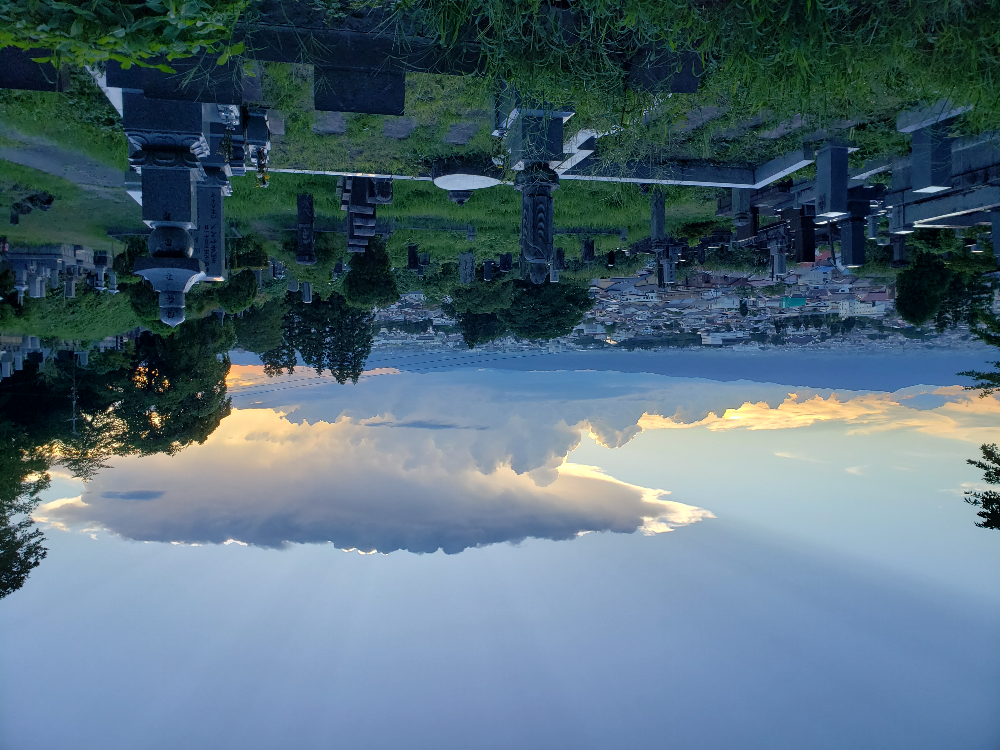
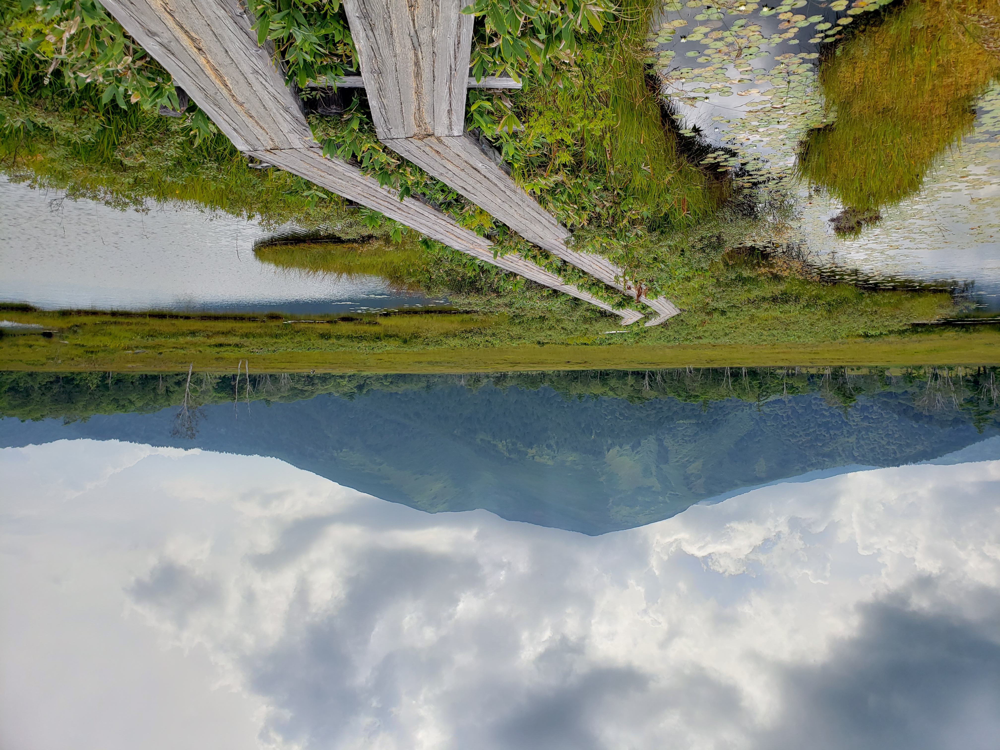
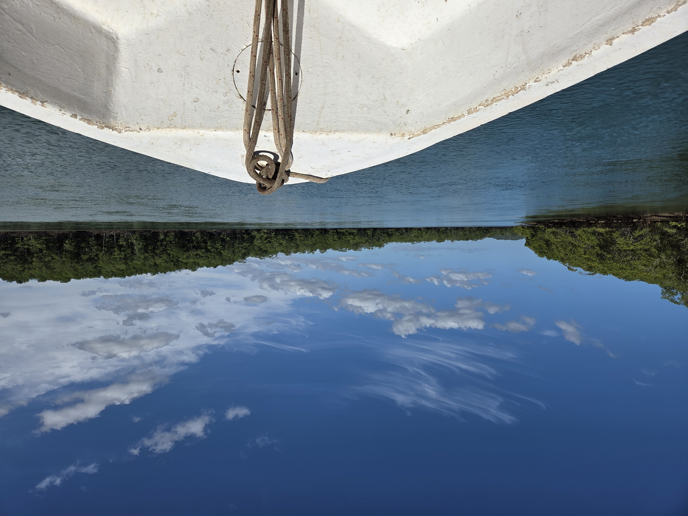
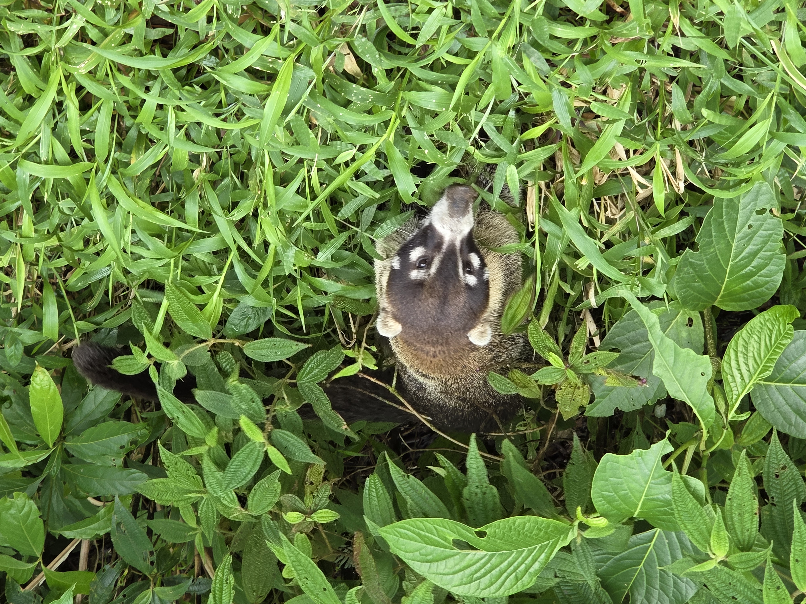
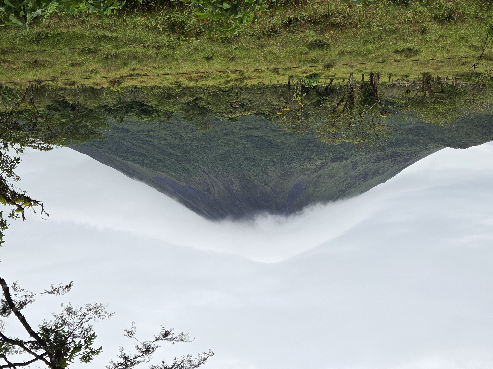
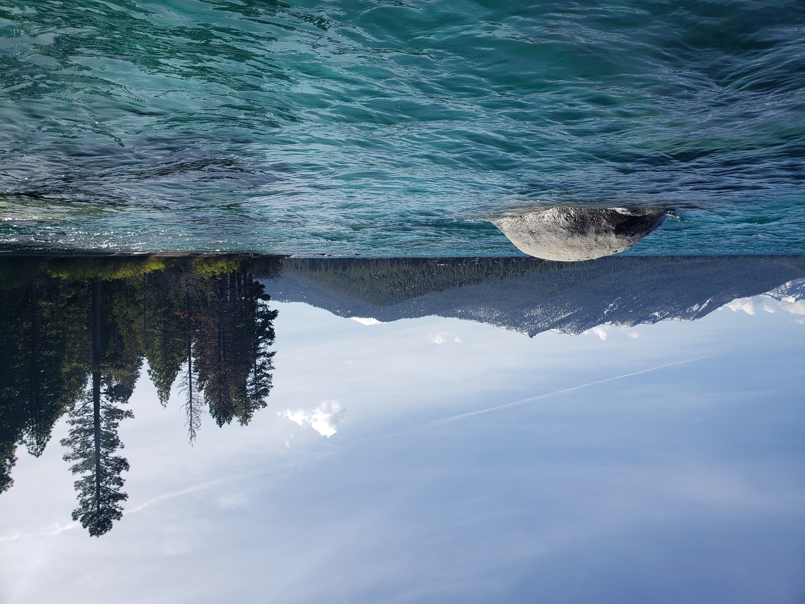
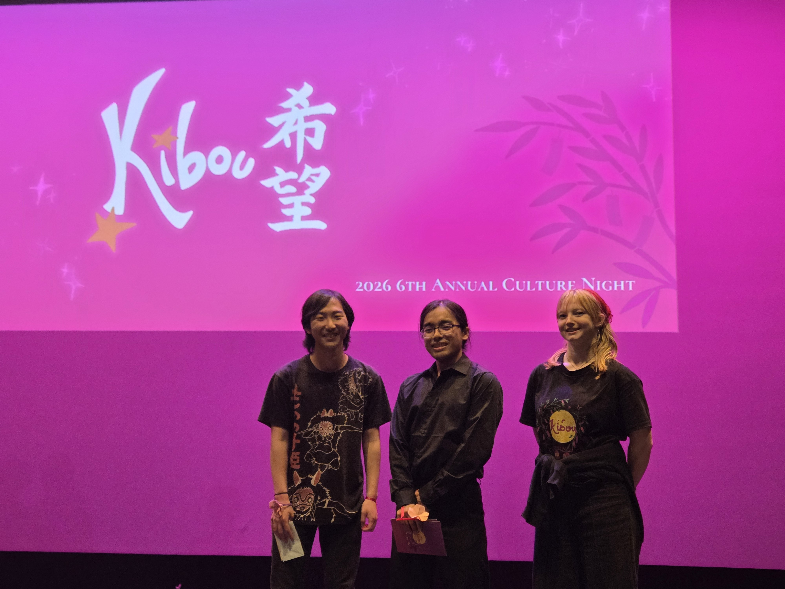
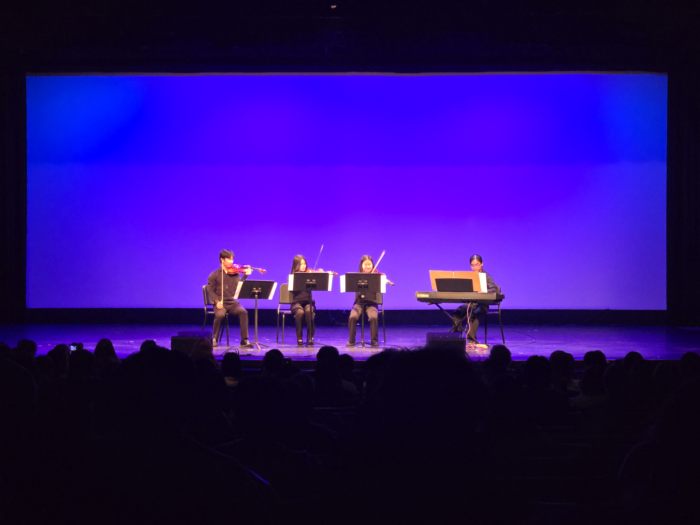
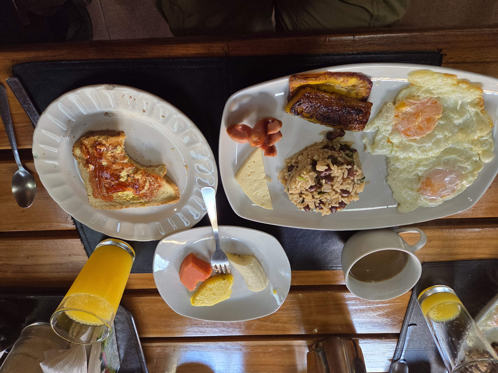
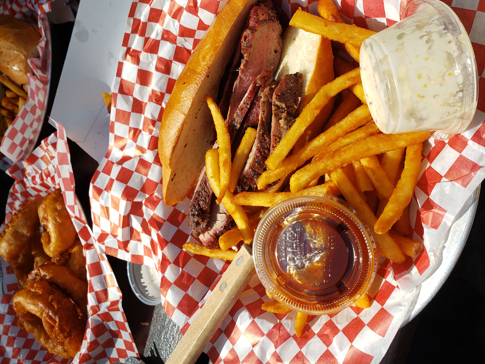

# About Me

Hi, my name is Shunji Shimoyoshi and I am a third year student at the University of California, Santa Barbara. I am currently pursuing a degree in Environmental Studies B.S. as well as a minor in Earth Science. My main focus and interest is in ecological restoration and plant ecology.

I became really interested in ecology because I love being outdoors and experiencing nature. Growing up, my family would take all kinds of trips around California, where I got to experience the vast diversity and beauty of the state’s ecosystems. From the sand dunes and salt basins of Death Valley to the pine forests of the Sierra Nevadas, I really gained an appreciation for all of the life that these landscapes supported. As I started thinking about what I wanted to study in college, I realized that I wanted to do my part in restoring these ecosystems and preserving them for future life.

# Travel Places

Here are some of the places I've traveled to over the years!

## Japan

::: {layout-ncol=2}

:::

Japan holds a special place in my heart because all of my relatives live there. Growing up, visiting Japan was always a highlight of the year for me.

## Costa Rica

::: {layout="[[1,1], [1]]"}

:::

Visiting Costa Rica with my family was a fantastic experience throughout. On this trip, I got to see the country's vast biodiversity, try amazing food, and meet some of the friendliest people around.

## Lake Tahoe

::: {layout-ncol=1}

:::

Closer to home, Lake Tahoe represents what I love about California and why I am passionate about ecology. The view of the lake nestled between the towering Sierra Nevada mountains and the sharp smell of pine trees is both nostalgic to me as well as a reminder of why I love this field.

# Communities I'm Involved In

::: {layout-ncol=2}

:::

One of the communities I have been most involved in at UCSB is Nikkei Student Union (NSU). UCSB NSU is a Japanese-American social and cultural organization that focuses on creating a welcoming community for everyone. Some of my favorite memories in college have come from the amazing friends I made through this club as well as our annual Culture Night. 

Culture Night (CN) is the biggest event of the year, which takes place in May and is entirely organized by our fellow club members. It features a play, talent acts, live music, and dance performances. I have been honored to take part in it every year (Kizuna [2024], Hokori [2025], Kibou [2026]) that I have been at UCSB and it genuinely means so much to me. I highly encourage everyone to attend UCSB NSU's Culture Night next year! (admission is completely free as well!)

# Favorite Foods

::: {layout-ncol=2}

I really enjoyed the simple and filling nature of the traditional Costa Rican breakfast of Gallo Pinto. It usually consists of rice and black beans, fried eggs, fried plantains, and fruit. I think I had this every morning during my trip and I never got tired of it.

This was a really great tri-tip sandwich that I had from a place called Cold Spring Tavern. It's located in a pretty interesting spot up the I-154 from Santa Barbara into the Santa Ynez Mountains. I think half the experience is eating it there in a surreal, yet serene atmosphere.
:::