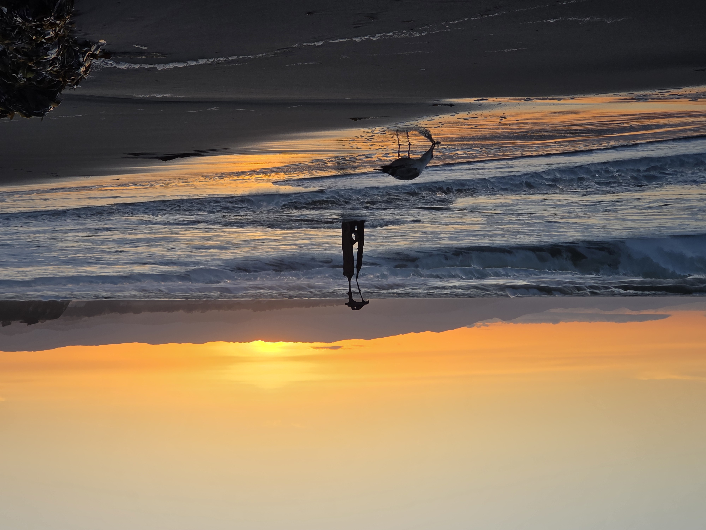
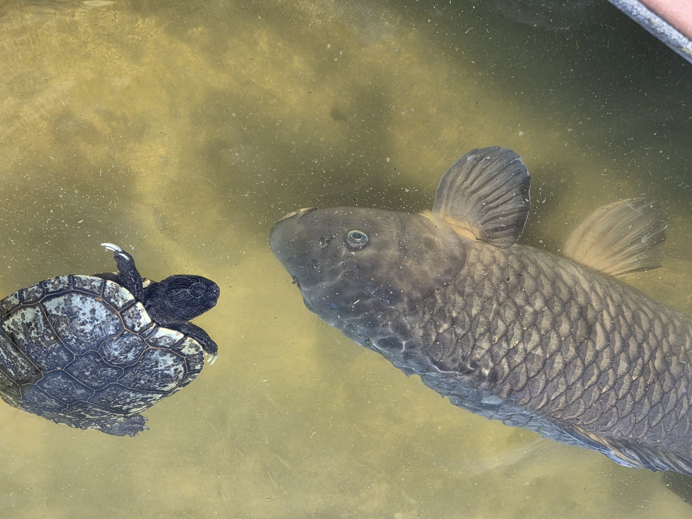
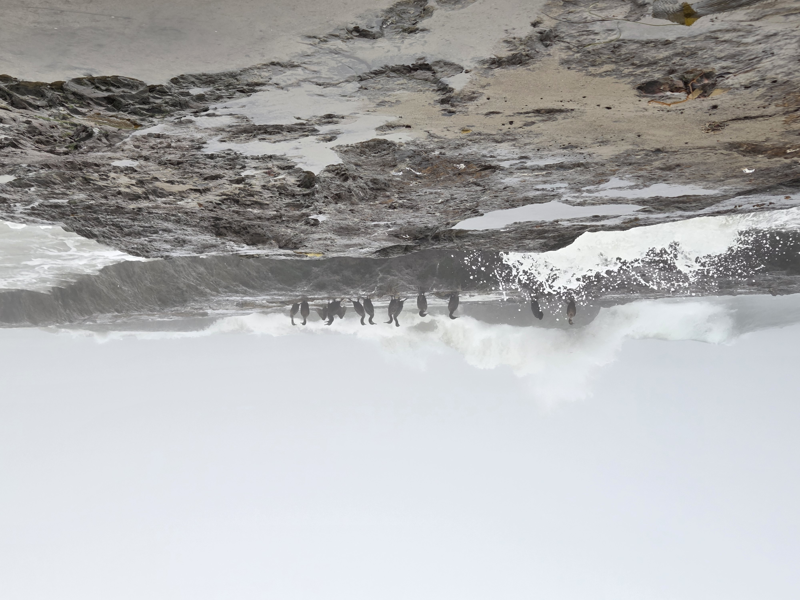
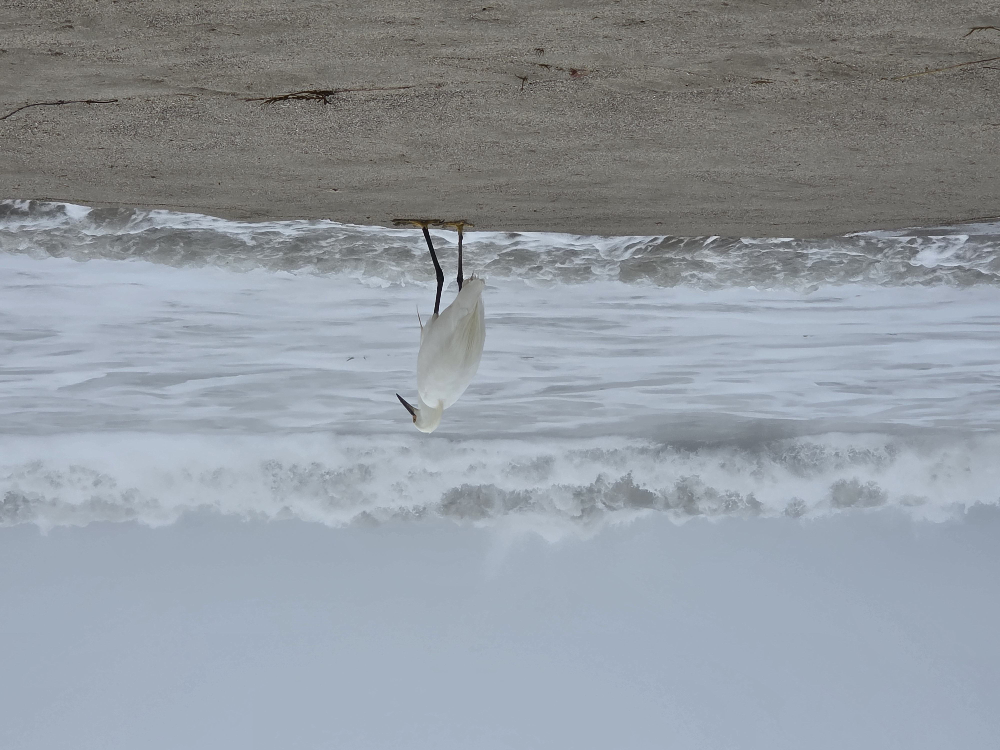
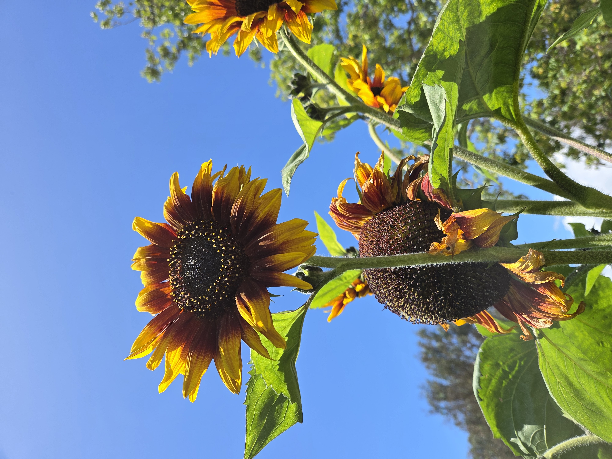
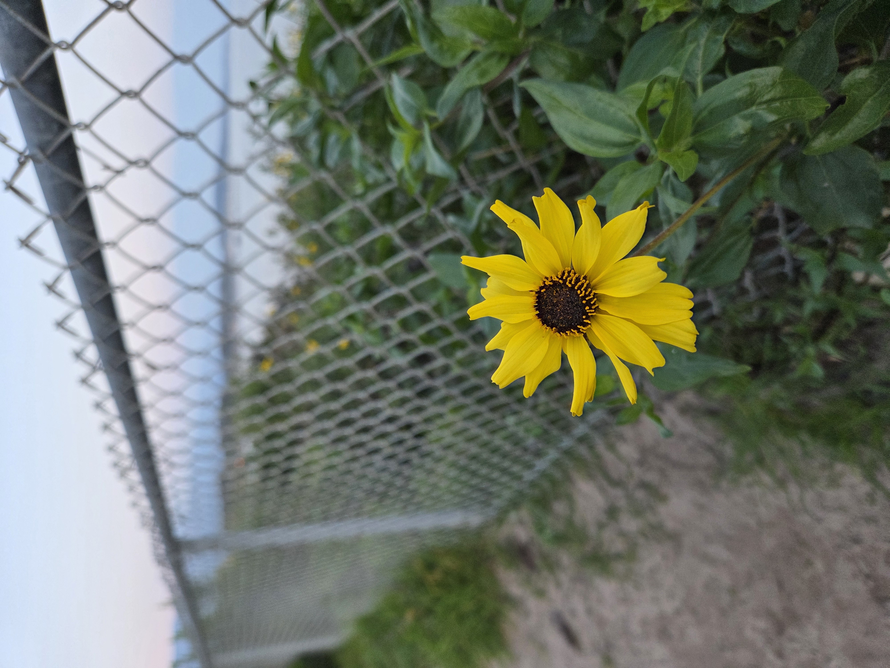
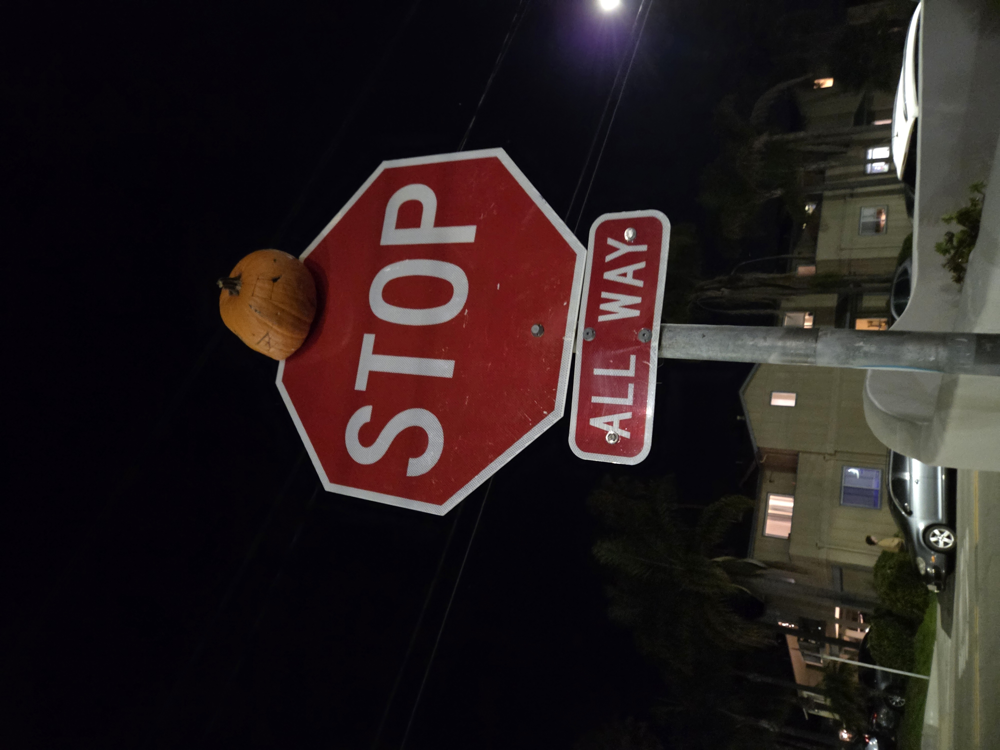
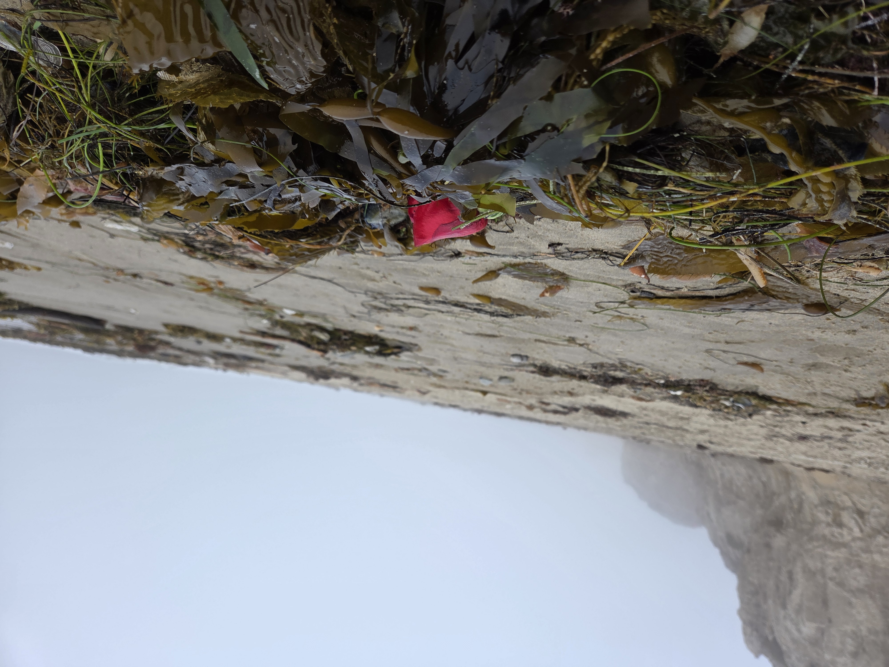
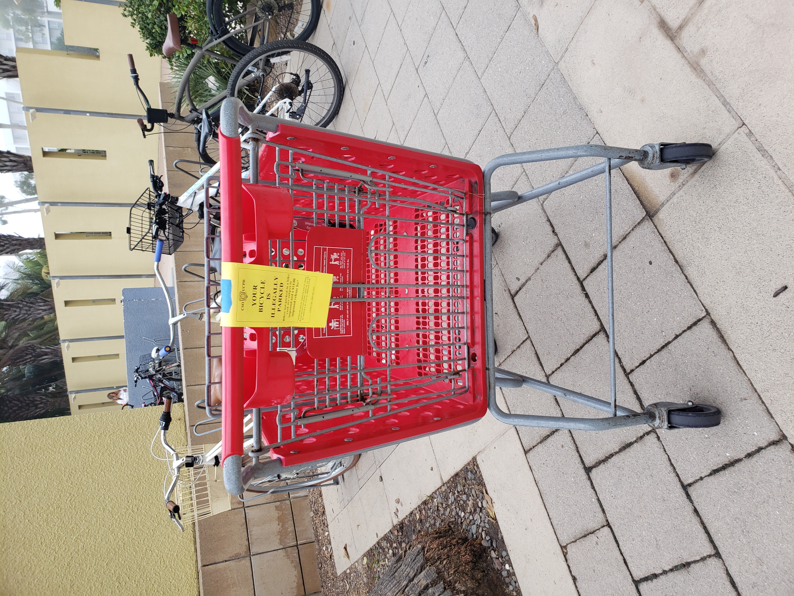
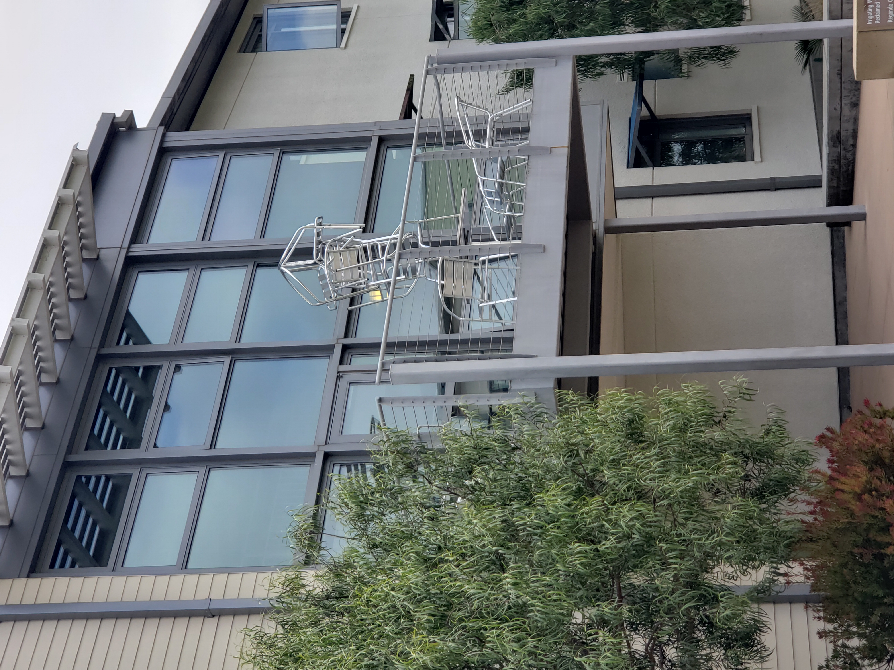

One of my hobbies in recent years has been photography. While I am definitely an amateur in this field still, I hope to keep on improving my skills by simply going out and taking more pictures.

These are some photo galleries of the life around UCSB. I find it fun and interesting to document even a fraction of all of the things that happen and live here.

# Wildlife

::: {layout-ncol=2}
{group="wildlife-gallery"}

{group="wildlife-gallery"}

{group="wildlife-gallery"}

{group="wildlife-gallery"}
:::

# Plants

::: {layout-ncol=2}
{group="plant-gallery"}

{group="plant-gallery"}
:::

# Just IV things

::: {layout-ncol=2}
{group="iv-gallery"}

{group="iv-gallery"}

{group="iv-gallery"}

{group="iv-gallery"}
:::

Locations of where I took these photos if you're interested!

```{r}
#| label: reading in packages and data
#| message: false
#| warning: false
#| include: false

# load packages
library(leaflet)
library(tidyverse)
library(here)
# reading in data
location <- read_csv(here("files","interactive_map_locations.csv"))
# creating custom icon
location_icon <- makeIcon(
  iconUrl = here::here("files", "camera-icon.png"),
  iconWidth = 30, iconHeight = 30
)

```

```{r}
#| label: creating interactive map
#| echo: false
#| message: false
#| warning: false

# initialize map
site_map <- leaflet() |>  
  
# add base map tiles (use `addTiles()` for Google maps tiles, OR `addProviderTiles()` for 3rd party base maps: https://leaflet-extras.github.io/leaflet-providers/preview/) ----
  addProviderTiles(providers$Esri.WorldImagery, group = "ESRI World Imagery") |>  
  addProviderTiles(providers$Esri.OceanBasemap, group = "ESRI Oceans") |> 
  
  # add mini map
  addMiniMap(toggleDisplay = TRUE, minimized = TRUE) |> 
  
  # set view over Isla Vista
  setView(lng =  -119.861935, lat = 34.414334, zoom = 13) |> 
  
  # adding locations markers with custom icons
  addMarkers(data = location,
             icon = location_icon,
             lng = ~lon, lat = ~lat,
             popup = paste("Photo:", location$photo,
                           "Coordinates (latitude/longitude):", location$lat, ",",
                           location$lon)) |> 

# add layers control
  addLayersControl(
    baseGroups = c("ESRI World Imagery", "ESRI Oceans"))

# display map
site_map

```
